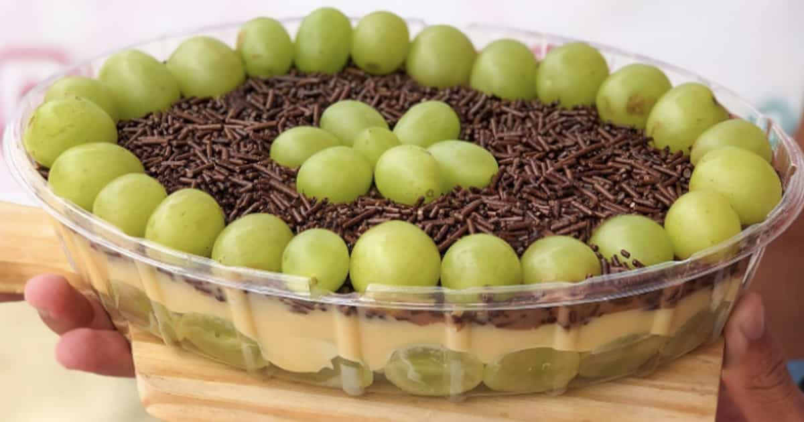

<!DOCTYPE html>
<html lang="pt-br">
<head>
    <meta charset="UTF-8">
    <meta http-equiv="X-UA-Compatible" content="IE=edge">
    <meta name="viewport" content="width=device-width, initial-scale=1.0">
    <title>Bombom</title>
    <link rel="stylesheet" href="madu.css">
</head>

<body> 
    <header>
        <nav>
<a href="index.html"> bombom de uva</a>
<a href="produtos.html"> outras receitas </a>
        <a href="https://www.youtube.com/watch?v=7oN6OaIe3Bw"> receita no youtube </a>
        </nav>
    </header>
    
    <h1>Bombom de uva na travessa</h1>
   
   <ul>
    <h2><em>INGREDIENTES</em></h2>
    <li>2 caixas de leite condensado</li>
    <li>2 caixas de creme de leite</li>
    <li>3 colheres de leite em pó</li>
    <li>Meia colher de manteiga</li>
    <li>Uva verde sem semente</li>
    <li>Uma barra de chocolate</li>
</ul>
   
Em uma panela adicione as 2 caixas de leite condensado,

   
uma caixa de creme de leite, 3 colheres de leite em pó e meia colher de manteiga.

   
Deixe no fogo baixo e misture até engrossar. Espere esfriar e acrescente as uvas, o quanto desejar.

  
   
Deixe o brigadeiro reservado. 

 
<H2><strong>GANACHE</strong></H2>

Derreta uma barra de chocolate em uma tigela, e incorpore uma caixa de creme de leite e

misture até ficar uniforme. Está pronta a ganache.

<H3><strong>MONTAGEM</strong></H3>

Adicione o brigadeiro com uva, uniformemente em uma tigela de vidro (ou de sua preferência),

inclua a ganache sobre o brigadeiro expalhando até cobri-lo por inteiro, coloque algumas uvas cortadas em cima da ganache para decorar e está 

  
pronto o bombom de uva na travessa.

    
        

    

        <ul>
            <h4> INGREDIENTES PARA SUBSTITUIR A UVA</h4>
            <li class="lista"> 🍌Banana🍌</li>
                
            <li class="lista">🌴cocô🌴</li>
                 
            <li class="lista"> 🍓Morango🍓 </li>
               
        </ul>
        <footer>
            
            
 COPYRIGHT SITE BOMBOM DE UVA- 2023

        </footer>
        </body>
        </html>
